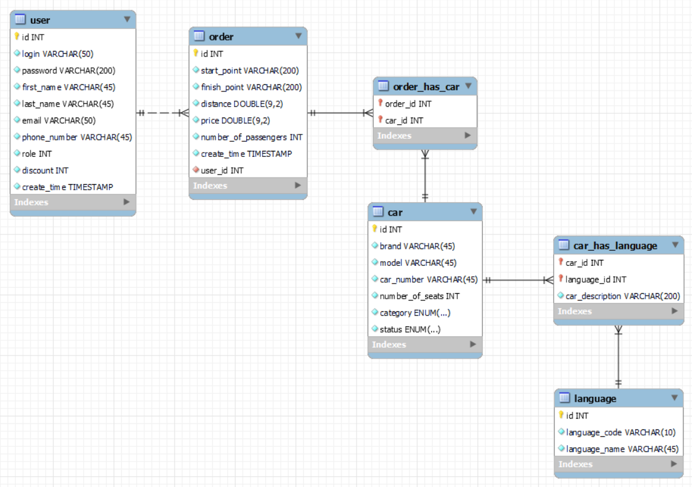

**Служба Таксі**

Існують ролі: «Клієнт», «Аміністратор».

Клієнт реєструється в системі та має можливість створювати замовлення на таксі, вказуючи адресу відправлення, адресу призначення, кількість пасажирів та категорію авто.

Служба таксі містить автопарк з водіями. Автомобіль має характеристики по місткості, категорії і може бути доступний: «до замовлення», «знаходиться в рейсі» або бути неактивним (знаходиться в автопарку без водія).

Система розраховує вартість поїздки в залежності від відстані та призначає відповідне авто серед доступних. Якщо відповідних авто немає —  клієнту може бути запропоновано скасувати замовлення або скористатися альтернативним рішенням:
- авто з потрібною кількістю місць, але іншої категорії;
- декілька автомобілів обраної категорії для забезпечення необхідної місткості. 

Система підтримує програму лояльності - розраховується знижка в залежності від  витраченої суми. Після підтвердження замовлення клієнтом, система повідомляє час очікування.

Адміністратор системи може переглядати статистику замовлень, сортувати:
- за датою оформлення замовлення;
- за вартістю замовлення

та фільтрувати замовлення:
- за клієнтами;
- за певними датами.
_________________________________
ER diagram:
